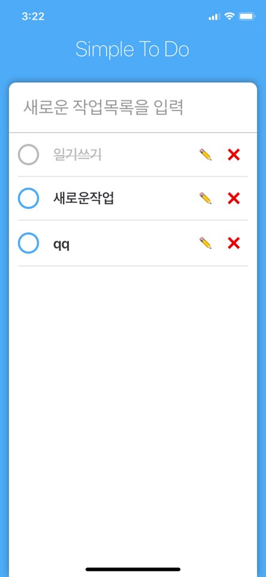

# simple-todo
Simple To Do App made with React Native

## 프로젝트 설치 및 사용방법 
1. git clone https://github.com/DevRappers/simple-todo
2. cd simple-todo
3. npm install
4. yarn start

## ScreenShot

    
    

